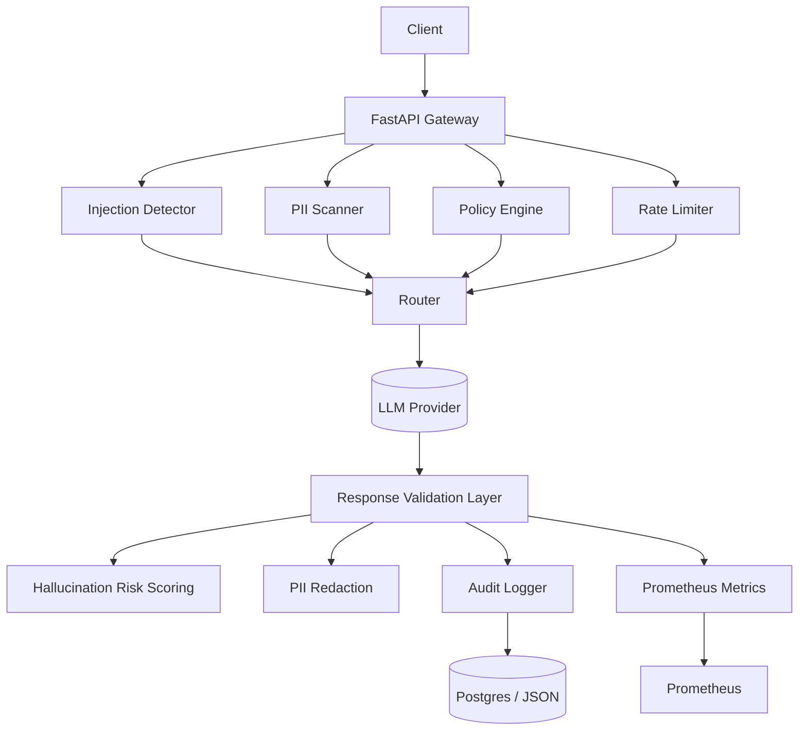

# Enterprise Secure LLM Gateway – Architecture

## System Overview

---

## Design Goals

- Layered security detection
- Minimal latency overhead (<30ms target)
- Cost-aware architecture
- Full auditability
- Production observability
- Concurrency stability

---

## Latency Breakdown Model

| Component | Target |
|-----------|--------|
| Injection Detection | <15 ms |
| PII Scan | <5 ms |
| Policy Check | <3 ms |
| Hallucination Scoring | <10 ms |
| Total Security Overhead | <30 ms |
